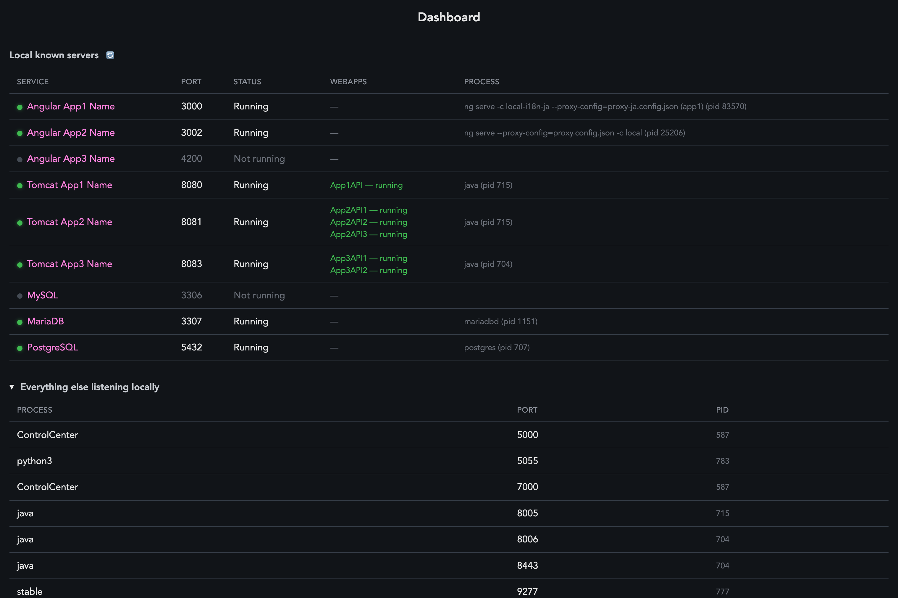

# README for Monitoring Dashboard



This app monitors the apps and ports you care about, and shows you which ones are running and which ones are not. It also includes what the pid is so you can stop them if you want to. They can be Tomcat servers, Angular/React, PostgresSQL, anything you have running that you want to monitor.

This app is created with help from Claude.

## Installation

This app requires Python with the version in the .python-version file.

Run `pip install -r requirements.txt` to install dependencies.

## Usage

Edit this section in `dashboard.py` to the apps and ports you care about:

```python
# ---------------------------------------------------------------------------
# Known servers to call out by name. A service can list multiple candidate
# ports (e.g. if you've moved it off its default). Edit freely.
# ---------------------------------------------------------------------------
SERVICES = [
    {"name": "Angular App1 Name",   "host": "localhost", "ports": [3000]},
    {"name": "Angular App2 Name",   "host": "localhost", "ports": [3002]},
    {"name": "Angular App3 Name",   "host": "localhost", "ports": [4200]},
    {"name": "Tomcat App1 Name",    "host": "localhost", "ports": [8080]},
    {"name": "Tomcat App2 Name",    "host": "localhost", "ports": [8081]},
    {"name": "Tomcat App3 Name",    "host": "localhost", "ports": [8083]},
    {"name": "MySQL",               "host": "localhost", "ports": [3306]},
    {"name": "MariaDB",             "host": "localhost", "ports": [3307]},
    {"name": "PostgreSQL",          "host": "localhost", "ports": [5432]},
]
```

For tomcat, you may edit this part to the username and password for your Tomcat manager in `dashboard.py`:

```python
def tomcat_running_webapps(port):
    """Parse `curl -u admin:password http://localhost:${port}/manager/text/list`."""
    if not shutil.which("curl"):
        return None
    url = f"http://localhost:{port}/manager/text/list"
    try:
        # set your username and password here for Tomcat manager
        out = subprocess.run(
            ["curl", "-s", "-u", "admin:password", url],
            capture_output=True, text=True, timeout=3,
        ).stdout
```

For SSL urls in the Services column, edit this section in `dashboard.js`:

```javascript
function url(port) {
    // set ssl ports here
    const sslPorts = [4200];
    let url = `http://localhost:${port}`;
    if (sslPorts.includes(port)) {
        url = `https://localhost:${port}`;
    }
    return url;
}
```

## Starting the app

To start the app, run:
```shell
python3 dashboard.py
```